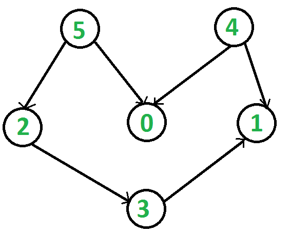

# Graph

A **Graph** is a data structure that consists of the following two components:

- A finite set of **vertices** (also called **nodes**).
- A finite set of **ordered pairs** of the form **(u, v)** called **edges**.
  - The pair is ordered because **(u, v)** is **not** the same as **(v, u)** in a **directed graph (digraph)**.
  - The pair **(u, v)** indicates that there is an edge from vertex **u** to vertex **v**.
  - The edges may contain **weight**, **value**, or **cost**.

---

# Applications of Graphs

Graphs are used to represent many real-life applications:

- **Networks**
  - Graphs are used to represent networks such as:
    - City road networks
    - Telephone networks
    - Circuit networks
  - **Example:** Google GPS

- **Social Networks**
  - Graphs are also used in social networking platforms like **LinkedIn** and **Facebook**.
  - In Facebook, each person is represented by a **vertex (node)**.
  - Each node contains information such as:
    - Person ID
    - Name
    - Gender
    - Locale

---

# Directed and Undirected Graphs

## Directed Graph

Directed graphs are graphs in which edges have a **single direction**.

> **Example:** the below graph is a directed graph:


---

## Undirected Graph

Undirected graphs are graphs in which the edges are **directionless** or **bi-directional**.

If there is an edge between vertices **u** and **v**, then:

- We can travel from **u → v**
- We can also travel from **v → u**

> **Example:** the below graph is an undirected graph:


---

# Representing Graphs

The two most commonly used representations of a graph are:

1. **Adjacency Matrix**
2. **Adjacency List**

---

# Adjacency Matrix

The **Adjacency Matrix** is a **2D array** of size **V × V**, where **V** is the number of vertices in the graph.

Let the matrix be **adj[][]**.

- `adj[i][j] = 1` indicates that there is an edge from vertex **i** to vertex **j**.
- For an **undirected graph**, the adjacency matrix is always **symmetric**.
- It can also represent **weighted graphs**.
  - If `adj[i][j] = w`, then there is an edge from **i** to **j** having **weight w**.

> **Example:** The adjacency matrix for the above example undirected graph is:


## Adjacency Matrix Representation

### Pros

- Easier to implement and understand.
- Removing an edge takes **O(1)** time.
- Checking whether an edge exists between two vertices (`u` and `v`) takes **O(1)** time.

### Cons

- Consumes **O(V²)** space.
- Even if the graph is **sparse** (contains fewer edges), it still consumes **O(V²)** space.
- Adding a new vertex takes **O(V²)** time.

---

# Adjacency List

A graph can also be represented using an **array of lists**.

- Every index of the array stores a list.
- The size of the array equals the number of vertices.
- Every index `i` stores the list of vertices connected to vertex `i`.

Let the array be **array[]**.

- `array[i]` represents the list of vertices adjacent to the **i-th** vertex.

This representation can also be used for **weighted graphs**.

- The weights can be represented as **lists of pairs**.

> **Example:** Following is the adjacency list representation of the above example undirected graph:


---

## Adjacency List Representation of Graph

Below is the implementation of the adjacency list representation of graphs.

> **Note:** In the implementation below, **dynamic arrays** are used to represent adjacency lists instead of a linked list.

```python
"""
A Python program to demonstrate the adjacency
list representation of the graph
"""

# A class to represent the adjacency list of the node


class AdjNode:
    def __init__(self, data):
        self.vertex = data
        self.next = None


# A class to represent a graph. A graph
# is the list of the adjacency lists.
# Size of the array will be the no. of the
# vertices "V"
class Graph:
    def __init__(self, vertices):
        self.V = vertices
        self.graph = [None] * self.V

    # Function to add an edge in an undirected graph
    def add_edge(self, src, dest):
        # Adding the node to the source node
        node = AdjNode(dest)
        node.next = self.graph[src]
        self.graph[src] = node

        # Adding the source node to the destination as
        # it is the undirected graph
        node = AdjNode(src)
        node.next = self.graph[dest]
        self.graph[dest] = node

    # Function to print the graph
    def print_graph(self):
        for i in range(self.V):
            print("Adjacency list of vertex {}\n head".format(i), end="")
            temp = self.graph[i]
            while temp:
                print(" -> {}".format(temp.vertex), end="")
                temp = temp.next
            print(" \n")


# Driver program to the above graph class
if __name__ == "__main__":
    V = 5
    graph = Graph(V)
    graph.add_edge(0, 1)
    graph.add_edge(0, 4)
    graph.add_edge(1, 2)
    graph.add_edge(1, 3)
    graph.add_edge(1, 4)
    graph.add_edge(2, 3)
    graph.add_edge(3, 4)

    graph.print_graph()
```

### Output

```text
Adjacency list of vertex 0
 head -> 4 -> 1

Adjacency list of vertex 1
 head -> 4 -> 3 -> 2 -> 0

Adjacency list of vertex 2
 head -> 3 -> 1

Adjacency list of vertex 3
 head -> 4 -> 2 -> 1

Adjacency list of vertex 4
 head -> 3 -> 1 -> 0
```

### Pros

- Saves space **O(|V| + |E|)**.
- In the worst case, there can be **C(V, 2)** edges in a graph, consuming **O(V²)** space.
- Adding a new vertex is easier.

### Cons

- Queries such as checking whether an edge exists between vertex **u** and vertex **v** are **not efficient**.
- Such queries take **O(V)** time.