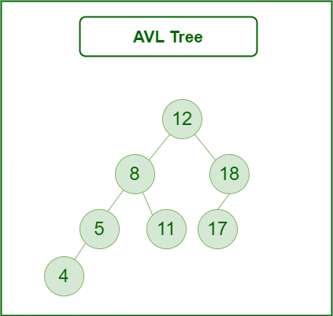
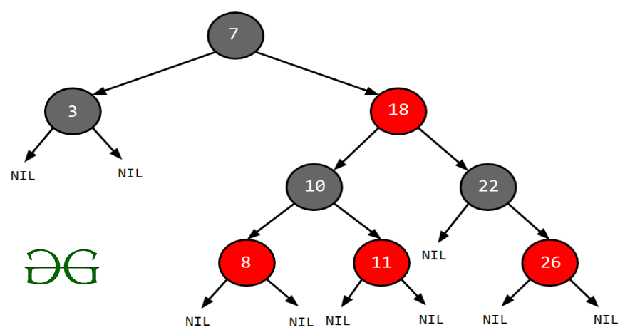

# Self-Balancing Binary Search Trees

Self-Balancing Binary Search Trees (BSTs) are height-balanced binary search trees that automatically keep their height as small as possible whenever insertion or deletion operations are performed.

The height is typically maintained in the order of **O(log n)**, allowing all major operations to run in **O(log n)** time on average.

---

# How Do Self-Balancing Trees Maintain Height?

A common technique used by self-balancing trees is **rotation**.

The two basic rotations used to rebalance a BST without violating the Binary Search Tree property are:

- Left Rotation
- Right Rotation

The BST property is:

```text
keys(left subtree) < key(root) < keys(right subtree)
```

## Right Rotation

```text
        y
       / \
      x   T3
     / \
    T1  T2

        Right Rotation

        x
       / \
      T1  y
         / \
        T2 T3
```

---

## Left Rotation

```text
        x
       / \
      T1  y
         / \
        T2 T3

         Left Rotation

        y
       / \
      x   T3
     / \
    T1 T2
```

Where:

- **T1**
- **T2**
- **T3**

are subtrees.

The order of keys always remains:

```text
keys(T1) < key(x) < keys(T2) < key(y) < keys(T3)
```

Hence, the **Binary Search Tree property remains unchanged** after rotation.

---

# Examples of Self-Balancing BSTs

The most common self-balancing BSTs are:

1. AVL Tree
2. Red-Black Tree
3. Splay Tree

---

# AVL Tree

An **AVL Tree** is a self-balancing Binary Search Tree in which the difference between the heights of the left and right subtrees of every node is **at most 1**.



Formally,

```text
| Height(Left Subtree) - Height(Right Subtree) | ≤ 1
```

Whenever this condition is violated, rotations are performed to restore balance.

---

# Red-Black Tree

A **Red-Black Tree** is a self-balancing Binary Search Tree where every node is colored either:

- Red
- Black



Basic properties include:

- The root is always black.
- Every NULL (leaf) node is black.
- No two consecutive red nodes are allowed.
- Every path from a node to its descendant NULL nodes contains the same number of black nodes.

These rules guarantee that the tree remains approximately balanced.

---

# Splay Tree

A **Splay Tree** is a self-balancing Binary Search Tree that moves the most recently accessed node to the root.

This operation is called **Splaying**.

Instead of maintaining strict balance, recently accessed elements become easier to access again.

## Basic Operations

- Insertion
- Searching
- Deletion
- Rotation

The two basic rotations are:

- Zig Rotation
- Zag Rotation

---

# Language Implementations

## C++

The C++ Standard Template Library (STL) provides:

- `set`
- `map`

These are generally implemented using **Red-Black Trees**.

---

## Java

Java provides:

- `TreeSet`
- `TreeMap`

Most implementations are based on **Red-Black Trees**.

---

## Python

Python's standard library does **not** include a self-balancing BST.

Alternatives include:

- `bisect` module (for maintaining sorted lists)
- `rbtree` package (Red-Black Tree implementation)
- `pyavl` package (AVL Tree implementation)

---

# Comparison of Self-Balancing Trees

| Metric | Red-Black Tree | AVL Tree | Splay Tree |
|---------|----------------|----------|------------|
| Worst Case Insertion | O(log n) | O(log n) | Amortized O(log n) |
| Maximum Height | 2 × log(n) | 1.44 × log(n) | O(n) |
| Worst Case Search | O(log n) (Moderate) | O(log n) (Faster) | Amortized O(log n) (Slower) |
| Extra Information Required | Three pointers + color bit | Two pointers + balance factor | Two pointers only |
| Worst Case Deletion | O(log n) | O(log n) | Amortized O(log n) |
| Mostly Used When | General-purpose balanced BST | Frequent searches | Same elements are accessed repeatedly |
| Real World Applications | Database indexing, Transactions | Map, Set, Multiset, Multimap | Cache implementation, Garbage Collection |

---

# Summary

- Self-Balancing BSTs maintain height close to **O(log n)**.
- Rotations are used to restore balance.
- **AVL Trees** provide stricter balancing and faster searches.
- **Red-Black Trees** offer slightly relaxed balancing with efficient insertions and deletions.
- **Splay Trees** optimize repeated accesses by moving recently accessed nodes to the root.
- Most standard libraries (C++ STL and Java Collections) use **Red-Black Trees** because they provide an excellent balance between search, insertion, and deletion performance.