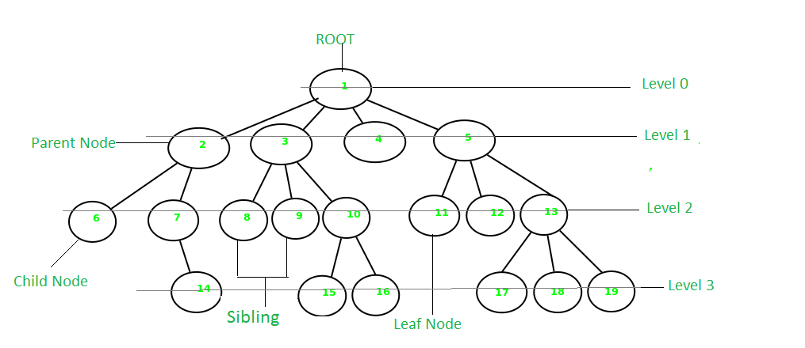
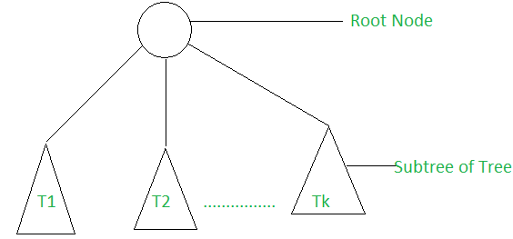
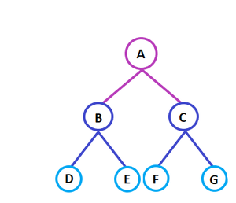
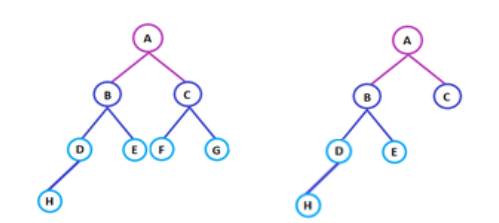

# Tree Data Structure

A **Tree** is a specialized method to organize and store data in a computer for efficient usage. It consists of a **central node (root)**, **structural nodes**, and **sub-nodes**, which are connected through **edges**.

A tree data structure contains:

- Root
- Branches
- Leaves

all connected in a hierarchical manner.




---

## Recursive Definition

A tree consists of a root and zero or more subtrees `T₁, T₂, ..., Tₖ` such that there is an edge from the root of the tree to the root of each subtree.



---

## Why is a Tree a Non-Linear Data Structure?

The data in a tree is **not stored sequentially**. Instead, it is arranged in a **hierarchical structure** with multiple levels. Since nodes can have multiple relationships rather than a single sequential relationship, a tree is classified as a **non-linear data structure**.

---

# Basic Terminologies in Tree Data Structure

## Parent Node

A node that is the predecessor of another node.

**Example:** Node `{2}` is the parent of nodes `{6, 7}`.

## Child Node

A node that is the immediate successor of another node.

**Example:** Nodes `{6, 7}` are children of node `{2}`.

## Root Node

The topmost node of a tree that has no parent.

**Example:** Node `{1}` is the root node.

### Properties

- A non-empty tree contains exactly one root node.
- There exists exactly one path from the root to every other node.

## Leaf Node (External Node)

Nodes that do not have any children.

**Example:** `{6, 14, 8, 9, 15, 16, 4, 11, 12, 17, 18, 19}`

## Ancestor of a Node

Any predecessor node on the path from the root to a given node.

**Example:** `{1, 2}` are ancestors of node `{7}`.

## Descendant of a Node

Any successor node on the path from a node to a leaf node.

**Example:** `{7, 14}` are descendants of node `{2}`.

## Sibling Nodes

Children of the same parent node.

**Example:** `{8, 9, 10}` are siblings.

## Level of a Node

The number of edges from the root node to the given node.

- Root node is at **Level 0**.

## Internal Node

A node having at least one child.

## Neighbour of a Node

The parent or child of a node.

## Subtree

Any node along with all of its descendants.

---

# Properties of a Tree

## Number of Edges

If a tree contains `N` nodes:

```text
Number of Edges = N - 1
```

There is exactly one path between any two nodes in a tree.

## Depth of a Node

The number of edges from the root node to the given node.

```text
Depth = Length of path from root to node
```

## Height of a Node

The length of the longest path from that node to any leaf node.

## Height of a Tree

The length of the longest path from the root node to any leaf node.

## Degree of a Node

The total number of subtrees (children) attached to a node.

### Properties

- Degree of a leaf node = 0
- Degree of a tree = Maximum degree among all nodes

---

# Additional Properties

- Traversal is performed using:
  - Depth First Search (DFS)
  - Breadth First Search (BFS)
- Contains no loops.
- Contains no circuits.
- Contains no self-loops.
- Represents a hierarchical model.

---

# Example of Tree Structure



Here:

- Node **A** is the root node.
- **B** is the parent of **D** and **E**.
- **D** and **E** are siblings.
- **D, E, F, G** are leaf nodes.
- **A** and **B** are ancestors of **E**.

---

# Types of Tree Data Structures

## 1. General Tree

A general tree has no restriction on the number of child nodes.

### Property

- A parent node can have any number of children.

## 2. Binary Tree

A binary tree allows a maximum of two child nodes per parent.

### Characteristics

- Left Child
- Right Child

Example:

- B, D, F → Left children
- E, C, G → Right children

## 3. Balanced Tree

A tree is balanced if:

```text
| Height(Left Subtree) - Height(Right Subtree) | ≤ 1
```

### Balanced Tree

- Height difference ≤ 1

### Unbalanced Tree

- Height difference > 1



## 4. Binary Search Tree (BST)

A Binary Search Tree is a non-linear tree used for efficient searching and sorting.

### Property

```text
Left Child < Parent < Right Child
```

### Examples

- AVL Tree
- Red-Black Tree

---

# Special Types of Binary Trees

- Full Binary Tree
- Complete Binary Tree
- Skewed Binary Tree
- Strictly Binary Tree
- Extended Binary Tree

---

# Applications of Tree Data Structure

## 1. Spanning Trees

Used in routers to determine the shortest path for packet transmission.

## 2. Binary Search Trees (BST)

Used to maintain sorted data efficiently.

Applications:

- Searching
- Sorting
- Data Organization

## 3. Storing Hierarchical Data

Used to represent hierarchical relationships such as:

- File Systems
- Organization Structures
- XML/HTML Documents

## 4. Syntax Trees

Used by compilers to represent the structure of source code.

## 5. Trie

A special tree used for:

- Fast spell checking
- Dictionary implementation
- Auto-completion
- Searching keys efficiently

## 6. Heap

A tree-based data structure represented using arrays.

### Applications

- Priority Queues
- Scheduling Algorithms
- Heap Sort

---

# Summary

Tree is a non-linear hierarchical data structure consisting of nodes connected through edges. It is widely used for:

- Searching
- Sorting
- Routing
- Compilers
- File Systems
- Priority Queues
- Spell Checking

Its hierarchical nature makes it one of the most important data structures in computer science.